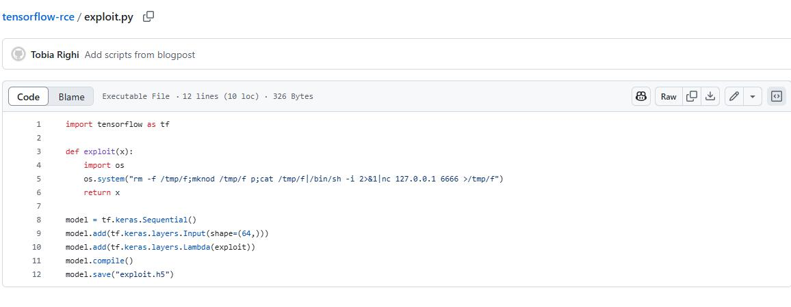
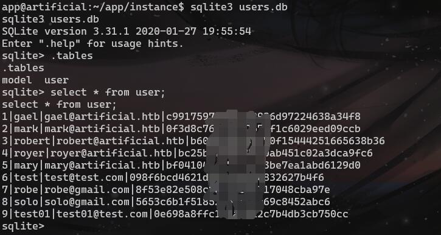
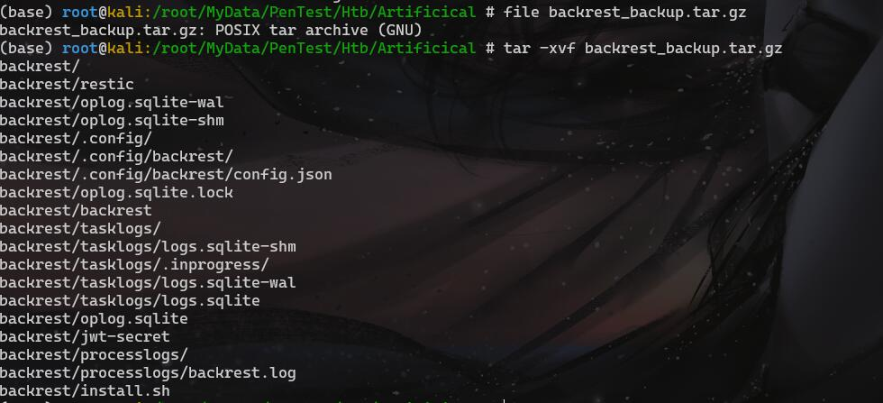
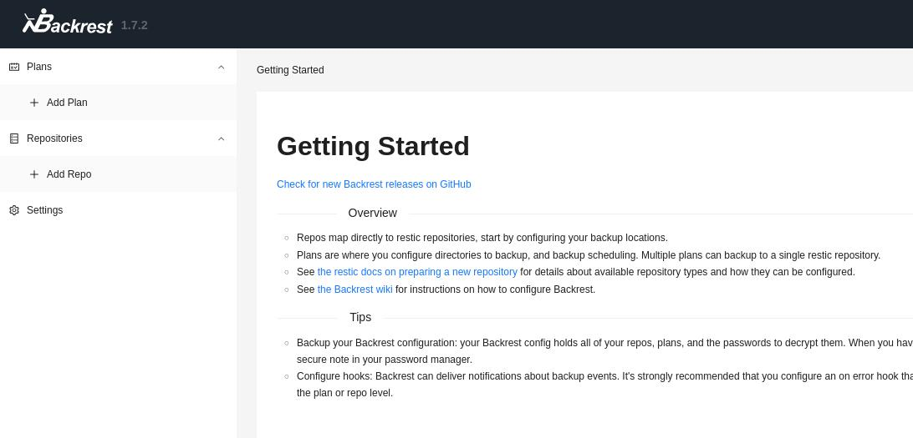
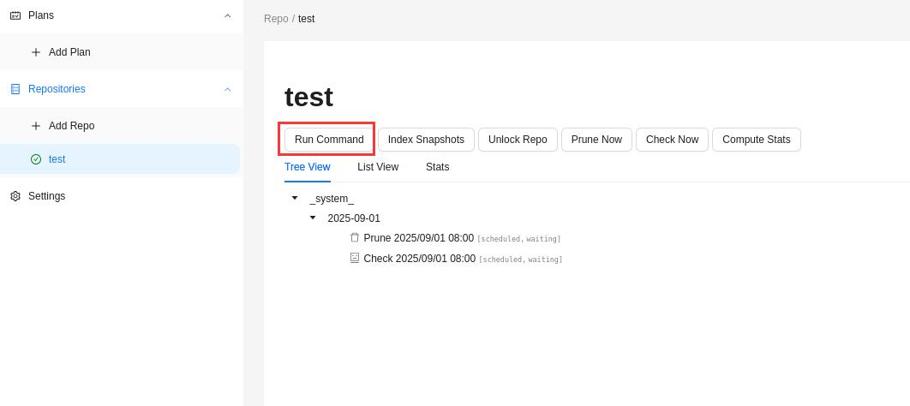
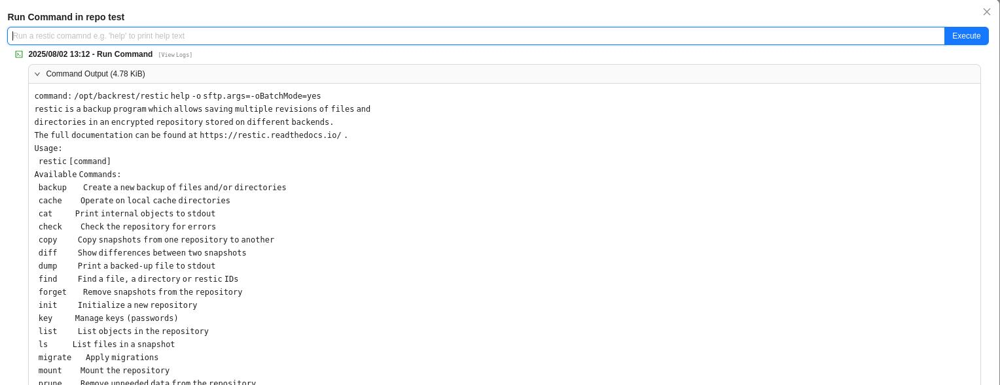
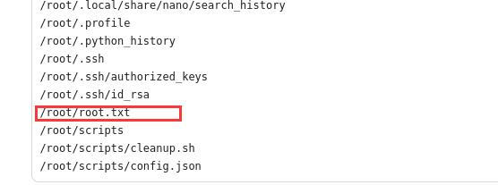

# Artificial #
## nmap探测 ##
#### `nmap -sT --min-rate 10000 -p- 10.10.11.74`

#### `nmap -sT -sC -sV -O -A -p 22,80 10.10.11.74`

#### 配置hosts绑定域名
#### `echo '10.10.11.74 artificial.htb' >> /etc/hosts`
## Web探测 ##
#### 浏览器访问artificial.htb

#### 访问注册页面注册一个账号

#### 使用刚才注册的账号登录，发现两个可下载的文件，还有一个上传点

#### 大概意思就是你可以自己构造一个模型，然后上传
#### 分别看下两个文件内容

#### 直接google一下看看

#### 在github上找到一个
[tensorflow-rce](https://github.com/Splinter0/tensorflow-rce)

#### 使用他们提供的dockerfile构建环境（我最开始没使用dockerfile构建的环境，生成的h5文件上传上去之后一直拿不到反弹shell。）
## 开始攻击 ##
#### `docker build -t artificial .`
#### 构建完会生成一个docker镜像

#### 使用构建的镜像启动容器
#### `docker run -itd --name artificial artificial`
#### 将编辑好的exploit.py复制到容器中
#### `docker cp exploit.py artificial:/code`
#### 进入容器生成h5文件
#### `docker exec -it artificial /bin/bash`

#### 再将生成的h5文件复制出去
#### `docker cp artificial:/code/exploit.h5 .`
#### 上传

#### 开启监听

#### 加载上传的模型

#### 在instance目录下看到了一个users.db，使用sqlite3打开

#### 将数据保存，看看passwd文件有没有用户能对上

#### 使用hashcat破解gael的hash
#### `hashcat -m 0 -a 0 c99175974b6e192936d97224638a34f8 /usr/share/wordlists/rockyou.txt`

#### 可以直接ssh登录

## 提权 ##
#### 一顿操作发现有nmap没有探测到的端口，突破口应该是在这

#### 使用ssh转发一下

#### `ssh -N -f -L 9898:localhost:9898 gael@10.10.11.74`

#### 试了gael的账号密码不行，google一下backrest是一个开源的备份应用，也没找到什么poc，再次返回服务器用关键字搜一下
#### `find ./ -name '*backrest*'`

#### 到目录下看看

#### 把备份文件下载下来

#### （这里要吐槽一下，设这个门槛有点此地无银三百两）

#### 用的base64，解码之后还有一层Bcrypt加密，再次是hashcat破解

#### `hashcat -m 3200 -a 0 root.hash /usr/share/wordlists/rockyou.txt`

#### 用这个账号密码再次登录，成功

#### 新建一个仓库可以执行命令

#### 输入`backup /root`会对整个root目录进行备份

#### 输入`ls 5020abe4/root`可以看到备份结果，里面就有root的flag

#### 输入`dump 5020abe4 root/root.txt`可以查看到root的flag

## END ##